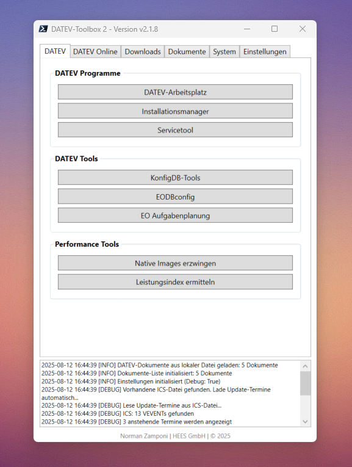

# DATEV-Toolbox 2.0

Eine moderne WPF-basierte PowerShell-Anwendung für DATEV-Umgebungen mit automatischen Updates, direkten Downloads und umfassenden Tools.

## 📸 Anwendungsvorschau



*Die DATEV-Toolbox 2.0 bietet eine intuitive tab-basierte Benutzeroberfläche für alle wichtigen DATEV-Tools und -Programme*

## 📋 Features

- **🆕 Server-Anpassungs-Assistent**: Neuer Button für DATEV Server-Konfiguration (DvServerChange.exe) (v2.1.10)
- **🆕 Windows Updates Integration**: System-Tab unterstützt jetzt Windows Updates für Client und Server (v2.1.10)  
- **🆕 Dokumente lastUpdated-Anzeige**: Datum der letzten Aktualisierung im Dokumente-Tab (v2.1.10)
- **🆕 Download-Info mit Rich-Text**: Fette Schrift für Labels und strukturierte Metadaten-Anzeige (v2.1.9)
- **🆕 Neuer Dokumente-Tab**: Direkter Zugriff auf wichtige DATEV-Anleitungen und Dokumentationen (v2.1.8)
- **🆕 Scrollbares Changelog-Fenster**: Benutzerfreundliche Anzeige der Update-Historie (v2.1.7)
- **🆕 Zentrale Konfiguration**: Alle URLs, Pfade und Einstellungen konfigurierbar (v2.1.0)
- **🆕 Kompakte UI**: Optimierte GroupBox-Abstände für platzsparende Darstellung (v2.1.4)
- **WPF-GUI**: Moderne tab-basierte Benutzeroberfläche
- **DATEV Programme**: Direkter Start von DATEV-Arbeitsplatz, Installationsmanager und Servicetool
- **DATEV Tools**: Zugriff auf KonfigDB-Tools, EODBconfig, EO Aufgabenplanung und Server-Anpassungs-Assistent
- **Performance Tools**: Leistungsindex und NGENALL 4.0 für Systemoptimierung
- **System Tools**: Integrierte Windows-Systemtools (Task-Manager, Ressourcenmonitor, Windows Updates)
- **🆕 Erweiterte Gruppenrichtlinien-Updates**: Progress-Dialog mit Abbruch-Funktion und Prozess-Überwachung (v2.1.4)
- **Automatische Updates**: Selbst-aktualisierendes System mit GitHub-Integration
- **DATEV Online Tools**: Schnellzugriff auf wichtige DATEV-Portale und -Services
- **🆕 Erweiterte Downloads**: Verwaltung und Download von DATEV-Software mit Aktualisierungsdatum
- **🆕 Dokumente-Tab**: Direkter Zugriff auf wichtige DATEV Help-Center Dokumentationen mit Aktualisierungsdatum
- **Update-Termine**: Anzeige anstehender DATEV-Updates
- **🆕 Scrollbares Changelog**: Benutzerfreundliche Update-Historie mit bis zu 10 Versionen
- **Logging-System**: Umfassendes Protokollsystem mit verschiedenen Log-Leveln
- **Einstellungsverwaltung**: Persistente Speicherung von Konfigurationen

## 🚀 Installation und Start

### Voraussetzungen
- **PowerShell 5.1+** (Windows PowerShell oder PowerShell Core)
- **.NET Framework 4.5+** (für WPF-Unterstützung)
- **Windows-Betriebssystem**

### Ausführung
```powershell
# Direkte Ausführung
pwsh.exe -File ".\DATEV-Toolbox 2.0.ps1"

# Oder über Windows PowerShell
powershell.exe -File ".\DATEV-Toolbox 2.0.ps1"
```

### Erste Schritte
1. **DATEV Tools nutzen**: Verwenden Sie den DATEV-Tab für direkten Zugriff auf Programme und Tools
2. **Direkt-Downloads aktualisieren**: Klicken Sie auf das 🔄-Symbol im Downloads-Tab
3. **Update-Termine laden**: Verwenden Sie das 🔄-Symbol im Einstellungen-Tab
4. **Updates prüfen**: Nutzen Sie "Nach Updates suchen" für manuelle Update-Checks

## 📁 Projektstruktur

```
DATEV-Toolbox 2.0/
├── DATEV-Toolbox 2.0.ps1    # Hauptanwendung
├── version.json              # Versionsinformationen und Changelog
├── datev-downloads.json      # Download-Konfiguration
├── datev-dokumente.json      # DATEV Help-Center Dokumenten-Sammlung
└── README.md                 # Diese Dokumentation
```

## 🔧 Konfiguration

Die Anwendung speichert alle Einstellungen und Logs im AppData-Ordner:
```
%APPDATA%\DATEV-Toolbox 2.0\
├── settings.json             # Benutzereinstellungen
├── Error-Log.txt            # Fehlerprotokoll
├── datev-downloads.json     # Lokale Download-Konfiguration
├── datev-dokumente.json     # Lokale Dokumenten-Sammlung
├── Jahresplanung_2025.ics   # DATEV Update-Termine
└── Updates/                 # Update-Dateien und Backups
    ├── *.backup             # Automatische Backups (letzte 5)
    ├── *.download           # Temporäre Update-Downloads
    └── *.bat                # Update-Installationsskripte
```

## 📦 Verfügbare Tabs

### 🛠️ DATEV
Vollständige DATEV-Integration mit drei Kategorien:
- **DATEV Programme**: DATEV-Arbeitsplatz, Installationsmanager, Servicetool
- **DATEV Tools**: KonfigDB-Tools, EODBconfig, EO Aufgabenplanung, Server-Anpassungs-Assistent
- **Performance Tools**: Leistungsindex, NGENALL 4.0 (Native Images)

### 🌐 DATEV Online
Schnellzugriff auf wichtige DATEV-Online-Services:
- **Hilfe und Support**: DATEV Hilfe Center, Servicekontakte, myUpdates
- **Cloud**: myDATEV Portal, DUO, LAO, Lizenzverwaltung, Rechteraum, RVO
- **Verwaltung**: SmartLogin Administration, Bestandsmanagement

### 📥 Downloads
- **🆕 Erweiterte Direkt-Downloads**: Verwaltung und Download von DATEV-Software
- **Aktualisierungsdatum**: Downloads zeigen das Datum der letzten Aktualisierung
- **Neueste Downloads**: Deinstallationsnacharbeiten-Tool V. 3.11 hinzugefügt
- **Automatische Updates**: Downloads werden von GitHub aktualisiert
- **Download-Ordner**: Direkter Zugriff auf heruntergeladene Dateien

### 📋 Dokumente
Neuer Tab für direkten Zugriff auf wichtige DATEV-Dokumentationen:
- **DATEV Help-Center Integration**: Direkter Zugriff auf offizielle Dokumentationen
- **Umfassende Anleitungen**: Windows Server-Einrichtung, Betriebssystem-Kompatibilität
- **5 wichtige Dokumente**: Server-Installation, Office-Umstieg, Deinstallation und mehr
- **Automatische Updates**: Dokumenten-Liste wird von GitHub aktualisiert
- **🆕 Aktualisierungsdatum-Anzeige**: Datum der letzten Aktualisierung wird prominent angezeigt
- **Ein-Klick-Zugriff**: Öffnet Dokumente direkt im Browser

### ⚙️ System
Integrierte Windows- und System-Tools:
- **🆕 Aktionen**: Gruppenrichtlinien-Update (gpupdate /force) mit asynchroner Ausführung
- **🆕 Windows Updates**: Cross-Platform-Button für Windows Updates (Client & Server kompatibel)
- **System Tools**: Task-Manager, Ressourcenmonitor, Ereignisanzeige
- **Verwaltung**: Dienste, Systemkonfiguration, Datenträgerbereinigung

### 🔧 Einstellungen
- **Konfiguration**: Zugriff auf Einstellungsordner
- **Update-Management**: Manuelle Update-Checks
- **🆕 Scrollbares Changelog**: Benutzerfreundliche Update-Historie mit bis zu 10 Versionen
- **Update-Termine**: Anzeige anstehender DATEV-Updates

## 🔄 Update-System

Die Anwendung verfügt über ein robustes automatisches Update-System:

- **Automatische Checks**: Alle 24 Stunden
- **Sichere Downloads**: TLS 1.2 verschlüsselt von GitHub
- **Backup-System**: Automatische Backups vor Updates
- **Rollback-Funktion**: Wiederherstellung bei fehlgeschlagenen Updates
- **Update-Historie**: Verfolgung aller durchgeführten Updates

### Manuelle Updates
```powershell
# In der Anwendung: Einstellungen → "Nach Updates suchen"
```

## 📝 Logging

Das integrierte Logging-System protokolliert alle Aktivitäten:
- **INFO**: Normale Betriebsmeldungen
- **WARN**: Warnungen (werden in Error-Log.txt gespeichert)
- **ERROR**: Fehler (werden in Error-Log.txt gespeichert)

## 🤝 Entwicklung

### Version
Aktuelle Version: **2.1.10**

### Autor
**Norman Zamponi** | HEES GmbH | © 2025

### Repository
- **GitHub**: [Zdministrator/DATEV-Toolbox-2.0](https://github.com/Zdministrator/DATEV-Toolbox-2.0)
- **Updates**: Automatisch von GitHub main branch

### Systemanforderungen
- PowerShell 5.1+ kompatibel
- Windows mit .NET Framework 4.5+
- WPF-Unterstützung erforderlich
- DATEV-Installation (für DATEV-Tools, optional)
- Internetverbindung für Updates und Downloads

### Neue Features in Version 2.1.10

#### 🔧 Server-Anpassungs-Assistent
- **Neuer DATEV-Tool Button**: Server-Anpassungs-Assistent im DATEV Tools Bereich hinzugefügt
- **DvServerChange.exe Integration**: Direkter Zugriff auf DATEV Server-Konfigurationstool
- **Intelligente Pfadsuche**: Automatische Erkennung über %DATEVPP% Umgebungsvariable
- **Benutzerfreundlich**: Schraubenschlüssel-Icon und aussagekräftiger Tooltip

#### 🔄 Windows Updates Integration
- **System-Tab-Erweiterung**: Windows Updates Button für direkten Zugriff hinzugefügt  
- **Cross-Platform-Support**: Funktioniert sowohl auf Windows Client als auch Server
- **Intelligente Erkennung**: 4-Tier-Fallback-System für optimale Kompatibilität
- **Moderne Settings App**: Bevorzugung der neuen Windows 10/11 Update-Oberfläche
- **Legacy-Support**: Automatischer Fallback auf Control Panel für ältere Systeme

#### 📋 Dokumente-Tab-Verbesserungen
- **lastUpdated-Datum**: Aktualisierungsdatum wird prominent oberhalb der Liste angezeigt
- **Deutsche Formatierung**: DD.MM.YYYY-Format für bessere Lesbarkeit
- **Echtzeit-Aktualisierung**: Datum wird beim Laden der Dokumenten-Liste aktualisiert
- **Benutzerfreundlichkeit**: Kleine, graue Schrift für dezente aber wichtige Information

### Neue Features in Version 2.1.9

#### 📥 Download-Info-Enhancement: Fette Schrift und vollständige Metadaten
- **Erweiterte Download-Information**: Info-Feld zeigt jetzt Zusatzinformationen (Erschienen, Dateiname, Dateigröße)
- **Fette Formatierung**: Labels "Erschienen:", "Dateiname:" und "Dateigröße:" werden fett dargestellt
- **Rich-Text-Implementierung**: WPF Inlines für professionelle und strukturierte Darstellung
- **Intelligente Formatierung**: Beschreibung + strukturierte Metadaten mit automatischen Leerzeilen
- **Vollständige JSON-Integration**: Alle Download-Felder werden korrekt gelesen und angezeigt
- **Verbesserte Benutzerfreundlichkeit**: Konsistente Anzeige für Downloads mit und ohne Zusatzinformationen
- **Professionelle Darstellung**: Strukturierte Metadaten-Anzeige für bessere Entscheidungsfindung

#### 📋 Dokumente-Tab: Direkter Zugriff auf DATEV-Anleitungen (v2.1.8)
- **Neuer 'Dokumente' Tab**: Zwischen Downloads und System eingefügt für bessere Navigation
- **DATEV Help-Center Integration**: 5 wichtige Dokumentationen verfügbar
- **Ein-Klick-Zugriff**: Windows Server-Setup, Betriebssystem-Kompatibilität, Office-Umstieg
- **Automatische Updates**: Dokumenten-Liste wird zentral von GitHub verwaltet
- **Benutzerfreundlich**: Saubere UI mit ScrollViewer und konsistenter GroupBox-Struktur

#### 📥 Download-Erweiterungen
- **Deinstallationsnacharbeiten-Tool V. 3.11**: Neue Download-Option hinzugefügt
- **Erweiterte Tool-Abdeckung**: Vollständige DATEV-Tool-Integration
- **Update-Links**: Modernisierte Download-URLs für neue DATEV-Strukturen

#### 🎨 UI/UX-Verbesserungen aus v2.1.7
- **Scrollbares Changelog-Fenster**: Von MessageBox auf WPF-Fenster umgestellt
- **Größenverstellbar**: 800x600 Pixel Standardgröße, mindestens 600x400
- **Bessere Lesbarkeit**: Monospace-Font (Consolas) für strukturierte Darstellung
- **Performance-optimiert**: Maximale Anzeige von 10 Versionen
- **Professional Look**: Deutlich benutzerfreundlichere Changelog-Anzeige

#### 📈 Verbesserungen aus vorherigen Versionen
- **Kompakte UI**: Optimierte GroupBox-Abstände für platzsparendere Darstellung (v2.1.4)
- **Zentrale Konfiguration**: Alle URLs, Pfade und Einstellungen konfigurierbar (v2.1.0)

## 🔄 Update-Historie

### Version 2.1.10 (2025-08-21)
- **🔧 Server-Anpassungs-Assistent**: Neuer Button für DATEV Server-Konfiguration (DvServerChange.exe)
- **🔄 Windows Updates Integration**: System-Tab unterstützt jetzt Windows Updates für Client und Server
- **📋 Dokumente lastUpdated-Anzeige**: Datum der letzten Aktualisierung im Dokumente-Tab

### Version 2.1.9 (2025-08-21)
- **📥 Download-Info-Enhancement**: Fette Schrift und vollständige Metadaten für Downloads
- **🎨 Rich-Text-Formatierung**: WPF Inlines für professionelle Info-Darstellung mit fetten Labels
- **📊 Strukturierte Metadaten**: Erschienen, Dateiname und Dateigröße in der Download-Info
- **🔧 JSON-Datenintegration**: Vollständige Übertragung aller Download-Felder zur UI
- **💡 Intelligente Formatierung**: Automatische Leerzeilen zwischen Beschreibung und Zusatzinfos
- **👥 Verbesserte UX**: Konsistente Anzeige für Downloads mit und ohne Zusatzinformationen
- **🏗️ Code-Verbesserung**: Tag-Objekt-Erweiterung für vollständige Metadaten-Übertragung

### Version 2.1.8 (2025-08-13)
- **📋 Dokumente-Tab**: Neuer Tab für direkten Zugriff auf wichtige DATEV-Dokumentationen
- **📧 E-Mail-Hinweis**: Responsiver Hinweis für weitere Dokument-Vorschläge mit automatischem Zeilenumbruch
- **🔗 Hyperlink-Integration**: Neue Hyperlink-Event-Handler für bessere Benutzerinteraktion
- **🎨 Grid-Layout**: Optimierte Textdarstellung für verschiedene Fenstergrößen
- **🌐 DATEV Help-Center Integration**: 5 wichtige Anleitungen verfügbar (Server-Setup, etc.)
- **📥 Download-Erweiterung**: Deinstallationsnacharbeiten-Tool V. 3.11 hinzugefügt
- **🏗️ UI-Verbesserung**: Saubere Tab-Struktur für bessere Navigation

### Version 2.1.7 (2025-08-06)
- **Scrollbares Changelog**: Von MessageBox auf großes WPF-Fenster umgestellt
- **Größenverstellbares Fenster**: 800x600 Standard, mindestens 600x400
- **Bessere Lesbarkeit**: Monospace-Font und bis zu 10 Versionen anzeigbar
- **Memory-Management**: WebClient ordnungsgemäß disposed
- **Professional Look**: Deutlich benutzerfreundlichere Update-Historie

### Version 2.1.6 (2025-08-05)
- **⚡ Performance-Optimierung**: Caching für DATEV-Pfad-Suche implementiert
- **🧠 Memory-Management**: StringBuilder-Performance und Runspace-Pool
- **🔒 Thread-Sicherheit**: Settings-Verwaltung mit Monitor-Locks
- **🛡️ Fehlerbehandlung**: Robuste Event-Handler und Resource-Cleanup

### Version 2.1.5 (2025-08-05)
- **🐛 StringBuilder-Terminal-Ausgabe behoben**: Keine störenden Debug-Anzeigen mehr
- **🔄 GPUpdate-Funktion vereinfacht**: Von 200+ auf 50 Zeilen reduziert
- **🔗 Download-Links modernisiert**: Für neue DATEV myUpdates API-Struktur
- **🛠️ Code-Stabilisierung**: Alle kritischen Bugs behoben
- **⚡ Performance beibehalten**: Optimierungen aus v2.1.4 erhalten

### Version 2.1.4 (2025-07-18)
- **🎨 UI-Optimierung**: Kompaktere GroupBox-Abstände für bessere Raumnutzung
- **🔄 Robuste Prozess-Überwachung**: Verbesserte gpupdate-Funktion mit Progress-Dialog
- **🧠 Memory-Leak-Fixes**: Ordnungsgemäße Ressourcen-Freigabe
- **🔧 PowerShell 5.1 Kompatibilität**: WebClient-Funktionen angepasst

### Version 2.1.3 (2025-07-04)
- **✅ Vollständige Feature-Implementierung**: Alle Button-Handler funktionsfähig
- **🎛️ Event-Handler-System**: URL-, DATEV-, SystemTool- und Function-Handler
- **⚡ Performance-Optimierungen**: Caching und asynchrone Operationen

## 🛠️ Technische Details

### Architektur
- **PowerShell 5.1+ kompatibel**: Vollständige Rückwärtskompatibilität
- **WPF-basierte GUI**: Moderne tab-basierte Benutzeroberfläche
- **Event-Handler-System**: Zentrale Verwaltung aller UI-Interaktionen
- **Automatisches Update-System**: GitHub-Integration mit Backup-Funktionalität

### Systemanforderungen
- PowerShell 5.1+ kompatibel
- Windows mit .NET Framework 4.5+
- WPF-Unterstützung erforderlich
- DATEV-Installation (für DATEV-Tools, optional)
- Internetverbindung für Updates und Downloads

## 📄 Lizenz

Dieses Projekt ist für den internen Gebrauch bei HEES GmbH entwickelt.

---

**Hinweis**: Diese Anwendung verbindet sich automatisch mit GitHub für Updates und Download-Konfigurationen. Stellen Sie sicher, dass eine Internetverbindung verfügbar ist.
